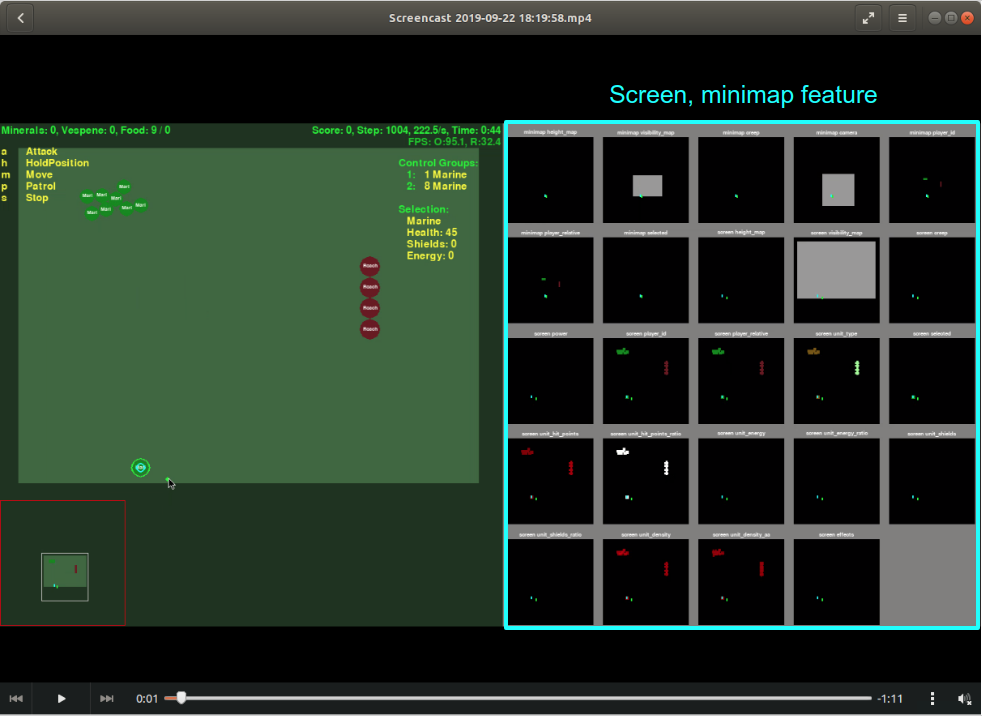
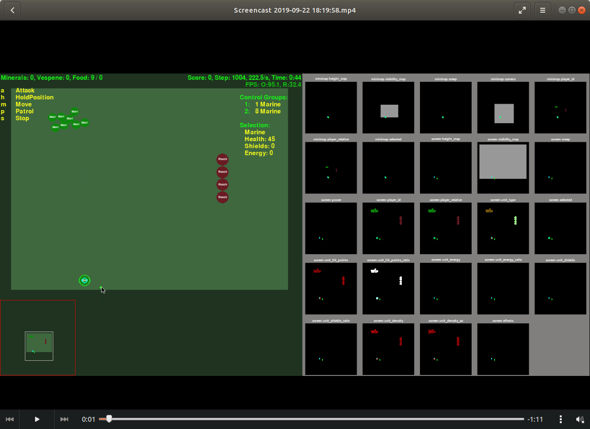
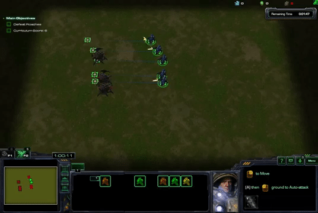
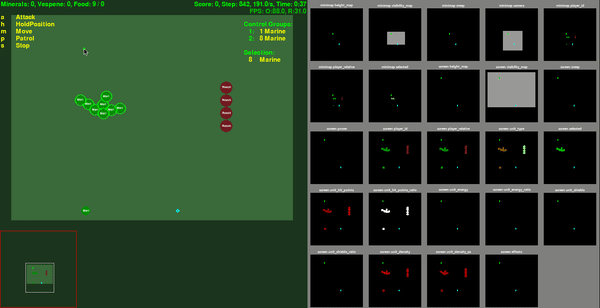

 

# Introduction
It is a agent for solving PySC2 DefeatRoaches minigames. 
You should intall Starcraft2 for linux and PySC2 python package for running that code from https://github.com/deepmind/pysc2.

After installing two defendency, please use a following command at your terminal 'python -m pysc2.bin.agent --map DefeatRoaches --agent DefeatRoaches_Agent.DefeatRoaches --use_feature_units True'

Running command looks difficult at first time, but you can understand it after knowing a folder structure of PySC2 package. 'pysc2.bin.agent' means that you will use a python file located in '<your python package install folder/lib64/python3.6/site-packages/pysc2'. At this file, you can also set up various options such as rendering, game_steps_per_episode and etc.

'DefeatRoaches_Agent.DefeatRoaches' means that you will use a agent class in DefeatRoaches_Agent.py file.

There are other minigames such as MoveToBeacon, CollectMineralShards. These minigames can be solved by a simple algorithm such as DQN. However, DefeatRoaches is little difficult for winning because a Roache unit is much strong to Marine player has to control.

# Observation Space
Minigame observation of PySC2 consist of largely screen, minimap feature. Screen feature has 84x84 image size and "height_map", "visibility_map", "creep", "power", "player_id" channel and minimap feature has 64x64 image size and "height_map", "visibility_map", "creep", "camera", "player_id". These two feature is very similar but minimap is little simple that screen.


Right part is display for screen and minimap feature

However, it is difficult to extract a exact position location of unit by using default feature. Thus, we should use a '--use_feature_units True' additional command for getting of exact location in screen. These feature also give a information unit is belong to which kind of team such as a enermy and my team.

```
marines = [unit for unit in obs.observation.feature_units
                 if unit.alliance == _PLAYER_SELF]
```                 
```          
roaches = [unit for unit in obs.observation.feature_units
                 if unit.alliance == _PLAYER_ENEMY]
```

```
marine_x_list = []
marine_y_list = []
for marine in marines:
  marine_x_list.append(marine.x)
  marine_y_list.append(marine.y)
```   

# Action Space
Action of minigame is consist of 0/no_op, 1/move_camera, 2/select_point, 3/select_rect, 4/select_control_group, 5/select_unit, 453/Stop_quick, 7/select_army, 451/Smart_screen, 452/Smart_minimap, 331/Move_screen, 332/Move_minimap, 333/Patrol_screen, 334/Patrol_minimap, 12/Attack_screen, 13/Attack_minimap, 274/HoldPosition_quick.

There is step function in PySC2 agent class, this function returns a specific action. You can select unit by select_point and select_rect. 

```  
return FUNCTIONS.select_point("select", marine_xy)
return FUNCTIONS.select_rect("select", 
                             [max(remain_marines_x_list), max(remain_marines_y_list)], 
                             [min(remain_marines_x_list), min(remain_marines_y_list)])
``` 

After selection unit, you can make that unit move Move_screen, Attack_screen.

``` 
return FUNCTIONS.Move_screen("now", [x_point, y_point])
return FUNCTIONS.Attack_screen("now", [x_point, y_point])
```

# Controlling unit manually
In PySC2 minigames, you can control unit by a code. Furthermore, you can also control it by using a 


Left part is for control unit by a hand. You can also collect a observation and action data of specific tactic.

# Tactics for defeating 4 Roach by using 9 Marine
It is impossible to winning at this minigame by using simple action sequence such as select_army, Attack_screen. It makes every Marines running to Roaches and attacking random Roach. 





