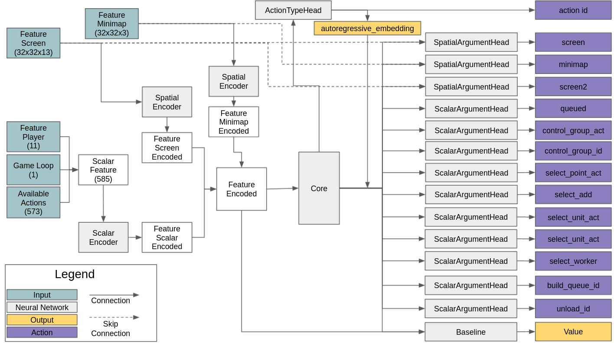
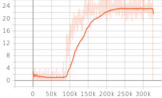
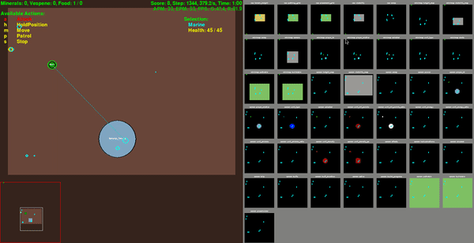

# Introduction
I am trying to implement AlphaStar based on supplementary material of DeepMind. Currently, I can solove the MoveToBeacon environment which is one of the mini-game  of PySC2 using the multi state encoder, the action head model structure of the AlphaStar.

# Reference
1. Download replay file(4.8.2 version file is needed): https://github.com/Blizzard/s2client-proto/tree/master/samples/replay-api
2. Extracting observation, action from replay file: https://github.com/narhen/pysc2-replay
3. FullyConv model of Tensorflow 1 version: https://github.com/simonmeister/pysc2-rl-agents

# Version
1. Python3
2. PySC2 3.0.0
3. Tensorflow 2.4.0
4. Tensorflow-probability  

# Network architecture



# Test for minigame
## MoveToBeacon
First, let's test the sample code for MoveToBeacon environment which is the simplest environment in PySC2 using model which has same network structure as AlphaStar. First, place [run.py](https://github.com/kimbring2/AlphaStar_Implementation/blob/master/run.py), [network.py](https://github.com/kimbring2/AlphaStar_Implementation/blob/master/network.py), [agent.py](https://github.com/kimbring2/AlphaStar_Implementation/blob/master/agent.py), [utils.py](https://github.com/kimbring2/AlphaStar_Implementation/blob/master/utils.py) files in your working folder. Next, start training by using below command.

```
$ python run.py --workspace_path /media/kimbring2/Steam/AlphaStar_Implementation/ --training True --gpu_use True --gradient_clipping 25.0 --learning_rate 0.0001
```

After the training is completed, test it using the following command. Training performance is based on two parameter. Try to use a 50.0 as the gradient_clipping and 0.0005 as the learning_rate. Futhermore, trarning progress and result are depends on the seed value. I use a 456 to get below training performance.



After placing [pretrained model](https://drive.google.com/drive/folders/1GQ9FsKGXYjWXhUI_6mBv2247IhU8iYma?usp=sharing) under Models folder of your workspace, run below command to test.

```
$ python run.py --workspace_path /media/kimbring2/Steam/AlphaStar_Implementation/ --visualize True --load True
```



If the accumulated reward is over 20 per episode, you can see the Marine follow the beacon well.

# Detailed information
I am writing explanation for code at Medium as series.

1. Tutorial about replay file: https://medium.com/@dohyeongkim/alphastar-implementation-serie-part1-606572ddba99
2. Tutorial about agent class: https://medium.com/@dohyeongkim/alphastar-implementation-serie-part2-3edced5df00b
3. Tutorial about encoder network: https://medium.com/@dohyeongkim/alphastar-implementation-series-part3-d315d2ad5a3
4. Tutorial about head network: https://dohyeongkim.medium.com/alphastar-implementation-series-part4-ee64bb93fe59
5. Tutorial about training network: https://dohyeongkim.medium.com/alphastar-implementation-series-part5-fd275bea68b5
6. Tensorflow 2.0 inplementation of FullyConv model: https://dohyeongkim.medium.com/alphastar-implementation-series-part6-4044e7efb1ce

# License
Apache License 2.0
