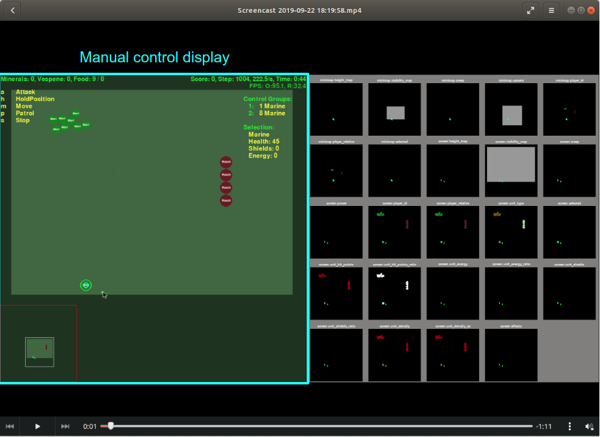
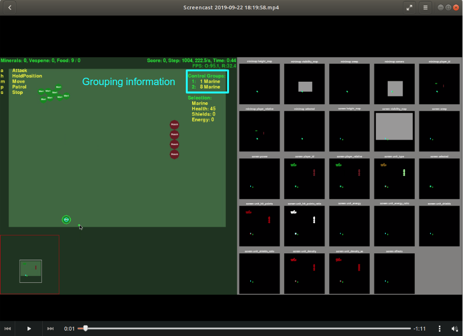
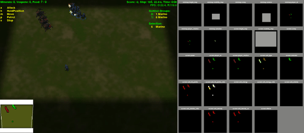
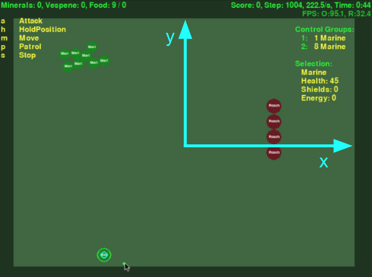

 

# Introduction
It is a agent for solving PySC2 DefeatRoaches minigames. 
You should intall Starcraft2 for linux and PySC2 python package for running that code from https://github.com/deepmind/pysc2.

After installing two defendency, please use a following command at your terminal 'python -m pysc2.bin.agent --map DefeatRoaches --agent DefeatRoaches_Agent.DefeatRoaches --use_feature_units True'

Running command looks difficult at first time, but you can understand it after knowing a folder structure of PySC2 package. 'pysc2.bin.agent' means that you will use a python file located in '<your python package install folder/lib64/python3.6/site-packages/pysc2'. At this file, you can also set up various options such as rendering, game_steps_per_episode and etc.

'DefeatRoaches_Agent.DefeatRoaches' means that you will use a agent class in DefeatRoaches_Agent.py file.

There are other minigames such as MoveToBeacon, CollectMineralShards. These minigames can be solved by a simple algorithm such as DQN. However, DefeatRoaches is little difficult for winning because a Roache unit is much strong to Marine player has to control.

# Observation Space
Minigame observation of PySC2 consist of largely screen, minimap feature. Screen feature has 84x84 image size and "height_map", "visibility_map", "creep", "power", "player_id" channel and minimap feature has 64x64 image size and "height_map", "visibility_map", "creep", "camera", "player_id". These two feature is very similar but minimap is little simple that screen.


Right part is display for screen and minimap feature

However, it is difficult to extract a exact position location of unit by using default feature. Thus, we should use a '--use_feature_units True' additional command for getting of exact location in screen. These features also give a information unit is belong to which kind of team such as a enermy and my team.

```
marines = [unit for unit in obs.observation.feature_units
                 if unit.alliance == _PLAYER_SELF]
```                 
```          
roaches = [unit for unit in obs.observation.feature_units
                 if unit.alliance == _PLAYER_ENEMY]
```

```
marine_x_list = []
marine_y_list = []
for marine in marines:
  marine_x_list.append(marine.x)
  marine_y_list.append(marine.y)
```   

# Action Space
Action of minigame is consist of 0/no_op, 1/move_camera, 2/select_point, 3/select_rect, 4/select_control_group, 5/select_unit, 453/Stop_quick, 7/select_army, 451/Smart_screen, 452/Smart_minimap, 331/Move_screen, 332/Move_minimap, 333/Patrol_screen, 334/Patrol_minimap, 12/Attack_screen, 13/Attack_minimap, 274/HoldPosition_quick.

There is step function in PySC2 agent class, this function returns a specific action. You can select unit by the select_point and select_rect action. 

```  
return FUNCTIONS.select_point("select", marine_xy)
return FUNCTIONS.select_rect("select", 
                             [max(remain_marines_x_list), max(remain_marines_y_list)], 
                             [min(remain_marines_x_list), min(remain_marines_y_list)])
``` 

After selection unit, you can make that unit move Move_screen, Attack_screen.

``` 
return FUNCTIONS.Move_screen("now", [x_point, y_point])
return FUNCTIONS.Attack_screen("now", [x_point, y_point])
```

# Controlling unit manually
In PySC2 minigames, you can control unit by a code. Furthermore, you can also control it by yourself.


Left part is for control unit by a hand.

# Setting and Recalling a group for easy control of Marines
It is impossible to winning at this minigame by using simple action sequence such as select_army, Attack_screen. It makes every Marine running to a Roache and attacking a random Roach and being defeated like a following video.


Humans are able to easily devise a tactic such as arracting some Roaches attention by using a only one Marine and attacking another Roaches by using remaning Marine. You can do these kind of controlling by using a big display.


Let's see how to make these kind of agent in python. As you can see in previous video, grouping one maring and other should be done first for making control more easy then select each Marine at every time.

```  
return FUNCTIONS.select_point("select", [remain_marines_x_list[0], remain_marines_y_list[0]]) 
return FUNCTIONS.select_control_group("set", 0)
```  

```  
return FUNCTIONS.select_rect("select", 
                             [remain_marines_x_list[1], remain_marines_y_list[1]], 
                             [remain_marines_x_list[-1], remain_marines_y_list[-1]])
return FUNCTIONS.select_control_group("set", 1)
``` 



We can set a one Marine as group 0 after selecting it by using a select_point action. And grouping of another Maring also can be done after selecting them by using a select_rect action. 

# Saving and playing a Replay
As you can see, the Pygame GUI display what PySC2 provides as a defalut rendering option is very simple. Thus, we can not see actual attack effect graphics. However, we should see how each unit attact each other for making more accurate algorithm.

By using a '--save_replay True' argument at runninn command, you can save a replay file of your code and watch it by using a 'python -m pysc2.bin.play --replay /home/kimbring2/Pysc2-Relation/DefeatRoaches_2019-09-23-07-07-47.SC2Replay' command. 



# Placing each Marine group separately in front of Roach Group
First thing what we should do after giving group number is moving them by using a group function. 



There are number of Marine and Roach. Thus, we should get a average of sum of position of each unit. After getting that value, we use it for controlling group.

```  
if ( (selected_marines_x_mean >= roache_x_mean) & (selected_marines_y_mean >= roache_y_mean) ):
  x_point = roache_x_mean + 25
  y_point = roache_y_mean + 20
elif ( (selected_marines_x_mean >= roache_x_mean) & (selected_marines_y_mean <= roache_y_mean) ):
  x_point = roache_x_mean + 25
  y_point = roache_y_mean + 20
elif ( (selected_marines_x_mean <= roache_x_mean) & (selected_marines_y_mean >= roache_y_mean) ):
  x_point = roache_x_mean - 25
  y_point = roache_y_mean + 20
elif ( (selected_marines_x_mean <= roache_x_mean) & (selected_marines_y_mean <= roache_y_mean) ):
  x_point = roache_x_mean - 25
  y_point = roache_y_mean + 20
  
if ( (x_point > 83) | (x_point < 1) | (y_point > 83) | (y_point < 1) ):
  return FUNCTIONS.no_op()

return FUNCTIONS.Move_screen("now", [x_point, y_point])
``` 

In this minigame, initial location is different little at each eposide. Thus, we consider every situation. And becasue screen size is limited to 84x84, we should make them below 84 when it goes over wall.

# Attracting a Rochaes by using one Marine
