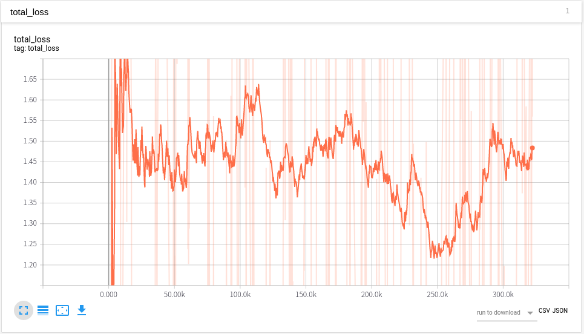

# Introduction
I am trying to implement AlphaStar based on supplementary material of DeepMind. Currently, I can solove the MoveToBeacon environment which is one of the mini-game  of PySC2 using the multi state encoder, the action head model structure of the AlphaStar.

# Reference
1. Download replay file(4.8.2 version file is needed): https://github.com/Blizzard/s2client-proto/tree/master/samples/replay-api
2. Extracting observation, action from replay file: https://github.com/narhen/pysc2-replay
3. FullyConv model of Tensorflow 1 version: https://github.com/simonmeister/pysc2-rl-agents
4. Supervised Learning technique: https://github.com/metataro/sc2_imitation_learning/tree/8dca03e9be92e2d8297a4bc34248939af5c7ec3b

# Version
1. Python3
2. PySC2 3.0.0
3. Tensorflow 2.3.0
4. Tensorflow-probability 0.12.2
5. Starcraft2 4.8.2 version

# Network architecture


# Test for minigame
## MoveToBeacon
First, let's test the sample code for MoveToBeacon environment which is the simplest environment in PySC2 using model which has similar network structure as AlphaStar. First, run 'git clone https://github.com/kimbring2/AlphaStar_Implementation.git' command in your workspace. Next, start training by using below command.

```
$ python run.py --workspace_path /media/kimbring2/Steam/AlphaStar_Implementation/ --training True --gpu_use True --gradient_clipping 25.0 --learning_rate 0.0001
```

After the training is completed, test it using the following command. Training performance is based on two parameter. Try to use a 25.0 as the gradient_clipping and 0.0001 as the learning_rate. Futhermore, trarning progress and result are depends on the seed value. Model is automatically saved if the average reward is over 5.0.


After finishing training, run below command to test pretrained model.

```
$ python run.py --workspace_path /media/kimbring2/Steam/AlphaStar_Implementation/ --visualize True --load True
```


If the accumulated reward is over 20 per episode, you can see the Marine follow the beacon well.

# Supervised Training 
To implement AlphaStar susuccessfully, Supervised Training is crucial. Instead of using the existing replay data to check simple network of mine, I collect amount of 1000 number of [replay files](https://drive.google.com/drive/folders/1lqb__ubLKLfw4Jiig6KsO-D0e_wrnGWk?usp=sharing) in Simple64 map using only Terran, and Marine rush from two Barrack with Random race opponent.

Please download [Supervised Training code](https://drive.google.com/drive/folders/1i9pooreywMpv7RERHHcc3ve_u-5FwKLg?usp=sharing) from Google Drive. It is not yet updated to GitHub.

First, change a Starcraft2 replay file to hkl file format for fast training. It will remove a step of no_op action except when it is occured at first, end of episode and 16 dividble step. You need a around 80GB disk space to convert number of around 1000 replay files to hkl.
```
$ python trajectory_generator.py --replay_path /home/kimbring2/StarCraftII/Replays/local_Simple64 --saving_path /media/kimbring2/6224AA7924AA5039/pysc2_dataset/simple64
```

After making hkl file of replay in your workspace, try to start the Supervised Learning using below command.

```
$ python run.py --workspace_path /media/kimbring2/Steam/AlphaStar_Implementation/ --training True --gpu_use True --gradient_clipping 25.0 --learning_rate 0.0001 --sl_training True --replay_hkl_file_path /media/kimbring2/6224AA7924AA5039/pysc2_dataset/simple64/ --environment Simple64
```

You can check training progress using Tensorboard under tensorboard folder of your workspace.


Below is code for evaluating trained model

```
python run.py --workspace_path /media/kimbring2/Steam/AlphaStar_Implementation/ --gpu_use True --load True --visualize True --environment Simple64
```

Video of downisde is one of behavior example of trained agent.

[](https://youtu.be/A4c3yb83KDY "AlphaStar Implementation - Click to Watch!")
<strong>Click to Watch!</strong>

I am still training my model. In my experience, it will take 2~3 days to finish. Final loss should be under 0.5.

# Detailed information
I am writing explanation for code at Medium as series.

1. Tutorial about replay file: https://medium.com/@dohyeongkim/alphastar-implementation-serie-part1-606572ddba99
2. Tutorial about agent class: https://medium.com/@dohyeongkim/alphastar-implementation-serie-part2-3edced5df00b
3. Tutorial about encoder network: https://medium.com/@dohyeongkim/alphastar-implementation-series-part3-d315d2ad5a3
4. Tutorial about head network: https://dohyeongkim.medium.com/alphastar-implementation-series-part4-ee64bb93fe59
5. Tutorial about training network: https://dohyeongkim.medium.com/alphastar-implementation-series-part5-fd275bea68b5
6. Tensorflow 2.0 inplementation of FullyConv model: https://dohyeongkim.medium.com/alphastar-implementation-series-part6-4044e7efb1ce

# License
Apache License 2.0
