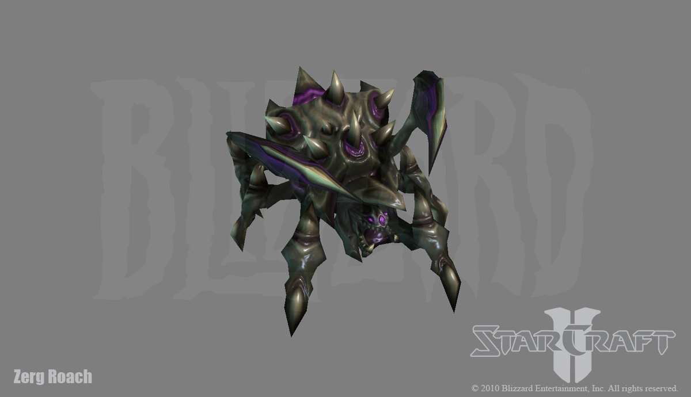

# PySC2_DefeatRoaches
It is Agent for solving PySC2 DefeatRoaches minigames. 
You should intall Starcraft2 for linux and PySC2 python package for running that code from https://github.com/deepmind/pysc2.

