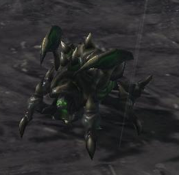
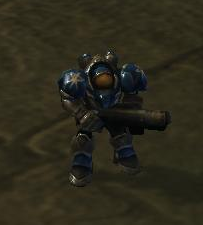

 

# Introduction
It is a agent for solving PySC2 DefeatRoaches minigames. 
You should intall Starcraft2 for linux and PySC2 python package for running that code from https://github.com/deepmind/pysc2.

After installing two defendency, please use a following command at your terminal 'python -m pysc2.bin.agent --map DefeatRoaches --agent DefeatRoaches_Agent.DefeatRoaches --use_feature_units True'

Running command looks difficult at first time, but you can understand it after knowing a folder structure of PySC2 package. 'pysc2.bin.agent' means that you will use a python file located in '<your python package install folder/lib64/python3.6/site-packages/pysc2'. At this file, you can also set up various options such as rendering, game_steps_per_episode and etc.

'DefeatRoaches_Agent.DefeatRoaches' means that you will use a agent class in DefeatRoaches_Agent.py file.

There are other minigames such as MoveToBeacon, CollectMineralShards. These minigames can be solved by a simple algorithm such as DQN. However, DefeatRoaches is little difficult for winning because a Roache unit is much strong to Marine player has to control.

# Observation Space
Minigame observation of PySC2 consist of largely screen, minimap feature. Screen feature has 84x84 image size and "height_map", "visibility_map", "creep", "power", "player_id" channel and minimap feature has 64x64 image size and "height_map", "visibility_map", "creep", "camera", "player_id". These two feature is very similar but minimap is little simple that screen.

However, it is difficult to extract a exact position location of unit by using default feature. Thus, we should use a '--use_feature_units True' additional command for getting of exact location in screen.

These feature also give a information unit is belong to which kind of team such as a enermy and my team.

# Action Space

Action of minigame  

