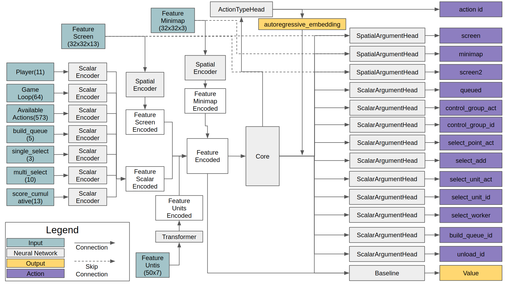

# Introduction
I am trying to implement AlphaStar based on supplementary material of DeepMind. Currently, I can solove the MoveToBeacon environment which is one of the mini-game  of PySC2 using the multi state encoder, the action head model structure of the AlphaStar.

# Reference
1. Download replay file(4.8.2 version file is needed): https://github.com/Blizzard/s2client-proto/tree/master/samples/replay-api
2. Extracting observation, action from replay file: https://github.com/narhen/pysc2-replay
3. FullyConv model of Tensorflow 1 version: https://github.com/simonmeister/pysc2-rl-agents
4. Supervised Learning technique: https://github.com/metataro/sc2_imitation_learning/tree/8dca03e9be92e2d8297a4bc34248939af5c7ec3b

# Version
## Python
1. Python3
2. PySC2 3.0.0
3. Tensorflow 2.4.0
4. Tensorflow-probability 0.11.0
5. Hickle

## Starcraft2
1. 4.8.2 version

# Memory leak issue
Current, I am migrating from [common style](https://github.com/pythonlessons/Reinforcement_Learning/blob/master/LunarLander-v2_PPO/LunarLander-v2_PPO.py) of Tensorflow to [new style](https://www.tensorflow.org/tutorials/reinforcement_learning/actor_critic]) because of memory leak issue during training. It seems like it is only problem of PySC2 when using it with Tensorflow 2 version. Other environment suah as LunarLander-v2 of OpenAI Gym has not same problem with Tensorflow 2.

# Network architecture


# Reinforcement Learning
## MoveToBeacon
First, let's test the sample code for MoveToBeacon environment which is the simplest environment in PySC2 using model which has similar network structure as AlphaStar. First, run 'git clone https://github.com/kimbring2/AlphaStar_Implementation.git' command in your workspace. Next, start training by using below command. 

```
$ python run.py --workspace_path /home/kimbring2/AlphaStar_Implementation/ --training True --gpu_use True --save_model True
```

I provide a FullyConv, AlphaStar style model. You can change a model by using the model_name argument. Default is FullyConv model.

After the training is completed, test it using the following command. Training performance is based on two parameter. Try to use a 25.0 as the gradient_clipping and 0.0001 as the learning_rate. Futhermore, trarning progress and result are depends on the seed value. Model is automatically saved if the average reward is over 5.0.


After finishing training, run below command to test pretrained model.

```
$ python run.py --workspace_path /media/kimbring2/Steam/AlphaStar_Implementation/ --visualize True --load_model True
```


If the accumulated reward is over 20 per episode, you can see the Marine follow the beacon well.

I do not use a Minimap feature for Minigame. It is only meaningful in Fullgame. 

# Supervised Learning 
## Simple64
To implement AlphaStar susuccessfully, Supervised Training is crucial. Instead of using the existing replay data to check simple network of mine, I collect amount of 1000 number of [replay files](https://drive.google.com/drive/folders/1lqb__ubLKLfw4Jiig6KsO-D0e_wrnGWk?usp=sharing) in Simple64 map using only Terran, and Marine rush from two Barrack with Random race opponent.

Please download the run.py, network.py, agent.py, utils.py, trajectory_generator.py, file from [Supervised Training code](https://drive.google.com/drive/folders/1i9pooreywMpv7RERHHcc3ve_u-5FwKLg?usp=sharing) from Google Drive. It is not yet updated to GitHub.

First, change a Starcraft2 replay file to hkl file format for fast training. It will remove a step of no_op action except when it is occured at first, end of episode and 8 dividble step. You need a around 80GB disk space to convert number of around 1000 replay files to hkl. Current, I only use replay file of Terran vs Terran.
```
$ python trajectory_generator.py --replay_path /home/kimbring2/StarCraftII/Replays/local_Simple64/ --saving_path /media/kimbring2/6224AA7924AA5039/pysc2_dataset/simple64
```

After making hkl file of replay in your workspace, try to start the Supervised Learning using below command.

```
$ python run.py --workspace_path /media/kimbring2/Steam/AlphaStar_Implementation/ --training True --gpu_use True --learning_rate 0.0001 --sl_training True --replay_hkl_file_path /media/kimbring2/6224AA7924AA5039/pysc2_dataset/simple64/ --environment Simple64
```

You can check training progress using Tensorboard under tensorboard folder of your workspace. It will take very long time to finish training becasue of vast of observation and action space.


Below is code for evaluating trained model

```
python run.py --workspace_path /media/kimbring2/Steam/AlphaStar_Implementation/ --gpu_use True --load True --visualize True --environment Simple64
```

Video of downisde is one of behavior example of trained agent.

[](https://youtu.be/ABomHc4_GlQ "AlphaStar Implementation - Click to Watch!")
<strong>Click to Watch!</strong>

I only use a replay file of Terran vs Terran case. Therefore, agent only need to recognize 19 unit during game. It can make the size of model do not need to become huge. Total unit number of Starcraft 2 is over 100 in full game case. For that, we need more powerful GPU to run.

# Detailed information
I am writing explanation for code at Medium as series.

1. Tutorial about replay file: https://medium.com/@dohyeongkim/alphastar-implementation-serie-part1-606572ddba99
2. Tutorial about agent class: https://medium.com/@dohyeongkim/alphastar-implementation-serie-part2-3edced5df00b
3. Tutorial about encoder network: https://medium.com/@dohyeongkim/alphastar-implementation-series-part3-d315d2ad5a3
4. Tutorial about head network: https://dohyeongkim.medium.com/alphastar-implementation-series-part4-ee64bb93fe59
5. Tutorial about training network: https://dohyeongkim.medium.com/alphastar-implementation-series-part5-fd275bea68b5
6. Tensorflow 2.0 inplementation of FullyConv model: https://dohyeongkim.medium.com/alphastar-implementation-series-part6-4044e7efb1ce

# License
Apache License 2.0
