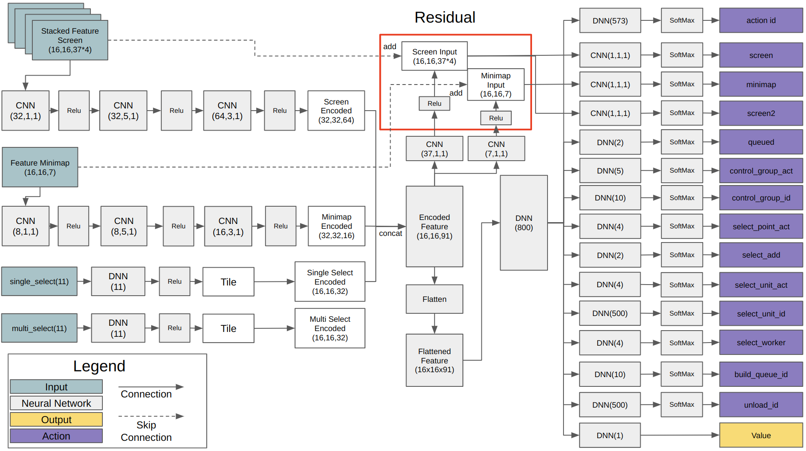
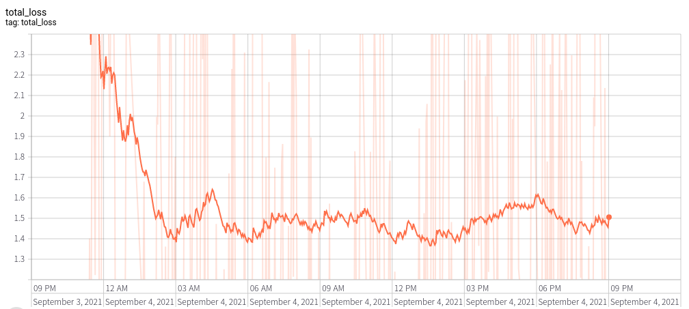

# Introduction
This repository is for Deep Learning agent of Starcraft2. It is very similar to AlphaStar of DeepMind except size of network. I only test my code with Minigame, Simple64 map of PySC2. However, I am sure this code will work at more large scale game if network size is grown.

# Reference
1. Download replay file(4.8.2 version file is needed): https://github.com/Blizzard/s2client-proto/tree/master/samples/replay-api
2. Extracting observation, action from replay file: https://github.com/narhen/pysc2-replay
3. FullyConv model of Tensorflow 1 version: https://github.com/simonmeister/pysc2-rl-agents
4. Supervised Learning technique: https://github.com/metataro/sc2_imitation_learning/tree/8dca03e9be92e2d8297a4bc34248939af5c7ec3b

# Version
## Python
1. Python3
2. PySC2 3.0.0: https://github.com/deepmind/pysc2
3. Tensorflow-gpu 2.3.0
4. Tensorflow-probability 0.11.0
5. Hickle 4.0.4
6. Pygame 1.9.6
7. Sklearn

## Starcraft2
1. Client 4.8.2: https://github.com/Blizzard/s2client-proto#downloads
2. Replay 4.8.2

## PC capaticy
1. NVIDIA RTX 3080 x 1
2. 32GB RAM
3. Ubuntu 20.04

# Comment for code
Instead of adding a comment to the code, overall explanation about code is written in Medium. Please visit using the link at the bottom of the page.

# Network architecture
## FullyConv


## AlphaStar


# Notice
There may be a minor error such a GPU setting, and network size. However, you can run it without major modification because I check that latest code works for Superviesed, Reinforcment Learning. It is not easy to check every part of code because it is huge.

# Supervised Learning 
I can only check that model with LSTM works well in Supervised Learning. FullyConv model does not show good performance yet although it fast then LSTM model for training. 

## Simple64
To implement AlphaStar susuccessfully, Supervised Training is crucial. Instead of using the existing replay data to check simple network of mine, I collect amount of 1000 number of [replay files](https://drive.google.com/drive/folders/1Tdt-7LaQWQijT7MZWYCr5fGn1CECUsFa?usp=sharing) in Simple64 map using only Terran, and Marine rush from two Barrack with Random race opponent.

First, change a Starcraft2 replay file to hkl file format for fast training. It will remove a step of no_op action except when it is occured at first, end of episode and 8 dividble step. You need a around 80GB disk space to convert number of around 1000 replay files to hkl. Current, I only use replay file of Terran vs Terran.
```
$ python trajectory_generator.py --replay_path [your path]/StarCraftII/Replays/local_Simple64/ --saving_path [your path]/pysc2_dataset/simple64
```

After making hkl file of replay in your workspace, try to start the Supervised Learning using below command. It will save a trained model under Models folder of your workspace.

```
$ python run_supervised_learning.py --workspace_path [your path]/AlphaStar_Implementation/ --model_name alphastar --training True --gpu_use True --learning_rate 0.0001 --replay_hkl_file_path [your path]/pysc2_dataset/simple64/ --environment Simple64 --model_name alphastar
```

You can check training progress using Tensorboard under tensorboard folder of your workspace. It will take very long time to finish training becasue of vast of observation and action space.



Below is code for evaluating trained model

```
python run_evaluation.py --workspace_path [your path]/AlphaStar_Implementation/ --gpu_use True --visualize True --environment Simple64 --pretrained_model supervised_model --model_name alphastar
```

Video of downisde is one of behavior example of trained agent.

[](https://youtu.be/ABomHc4_GlQ "AlphaStar Implementation - Click to Watch!")
<strong>Click to Watch!</strong>

I only use a replay file of Terran vs Terran case. Therefore, agent only need to recognize 19 unit during game. It can make the size of model do not need to become huge. Total unit number of Starcraft 2 is over 100 in full game case. For that, we need more powerful GPU to run.

# Reinforcement Learning
I can only check that FullyConv model works well in Reinforcement Learning. LSTM model takes too much time for training and does not show better performance than FullyConv yet.

In the case of RL, the training speed is improved by introducing [IMPALA](https://arxiv.org/abs/1802.01561) of DeepMind, which separates the learner and actor.


To run that training method, you first run the learner file using below command.
```
$ python learner.py --env_num 4 --gpu_use True --model_name fullyconv  --gradient_clipping 10.0
```

Next, you should run the multiple actor based on the number of env_num of learner. They should be ran from seperate terminal and can be distinguished from env_id.
```
$ python actor.py --env_id 0 --environment CollectMineralShards
$ python actor.py --env_id 1 --environment CollectMineralShards
$ python actor.py --env_id 2 --environment CollectMineralShards
$ python actor.py --env_id 3 --environment CollectMineralShards
```

I also provide the bash file to run the below process using [tmux](https://github.com/tmux/tmux/wiki). You can start the leaner and actors using single terminal.
```
./run_reinforcement_learning.sh 8 True CollectMineralShards fullyconv
```

You can also terminate the learner and actors using bash script.
```
./step.sh
```

## MoveToBeacon
First, let's test the sample code for MoveToBeacon environment which is the simplest environment in PySC2 using model which has similar network structure as AlphaStar. First, run 'git clone https://github.com/kimbring2/AlphaStar_Implementation.git' command in your workspace. Next, start training by using below command. 

```
$ python run_reinforcement_learning.py --workspace_path [your path]/AlphaStar_Implementation/ --training True --gpu_use True --save_model True --num_worker 5 --model_name alphastar
```

I provide a FullyConv, AlphaStar style model. You can change a model by using the model_name argument. Default is FullyConv model.

After the training is completed, test it using the following command. Training performance is based on two parameter. Try to use a 1.0 as the gradient_clipping and 0.0001 as the learning_rate. Futhermore, trarning progress and result are depends on the seed value. Model is automatically saved if the average reward is over 5.0.

Gradient clipping is essential for training the model of PySC2 because it has multiple stae encoder, action head network. In my experience, gradient norm value is changed based on network size. Therefore, you should check it everytime you change model structure. You can check it by using 'tf.linalg.global_norm' function.

```
grads = tape.gradient(loss, model.trainable_variables)
grad_norm = tf.linalg.global_norm(grads)
tf.print("grad_norm: ", grad_norm)
grads, _ = tf.clip_by_global_norm(grads, arguments.gradient_clipping)
```


Afater checking norm value, you should remove an outlier value among them.


After training 10 times ufing the FullyConv model, Following graph of score can be obtained. Note that there are no fail training during 10 times trial after adding Residual methoh to the screen, minimap action.


After finishing training, run below command to test pretrained model that was saved under Models folder of workspace. 

```
$ python run_evaluation.py --environment Simple64 --workspace_path [your path]/AlphaStar_Implementation --visualize True --model_name alphastar --pretrained_model reinforcement_model
```


If the accumulated reward is over 20 per episode, you can see the Marine follow the beacon well.

# Detailed information
I am writing explanation for code at Medium as series.

1. Tutorial about Replay file: https://medium.com/@dohyeongkim/alphastar-implementation-serie-part1-606572ddba99
2. Tutorial about Network: https://dohyeongkim.medium.com/alphastar-implementation-series-part5-fd275bea68b5
3. Tutorial about Reinforcement Learning: https://medium.com/nerd-for-tech/alphastar-implementation-series-part6-4044e7efb1ce
4. Tutorial about Supervised Learning: https://dohyeongkim.medium.com/alphastar-implementation-series-part7-d28468c07739
